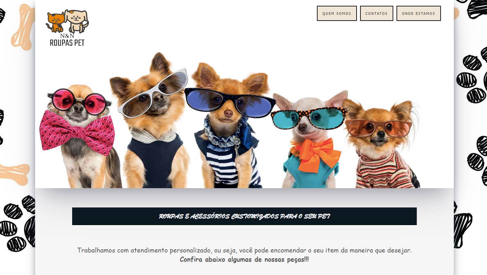

## N&N-RoupasPet

### 📄 Descrição:

Projeto em HTML e CSS para um ateliê de roupas e acessórios customizados para Pets.

##

### 💻 Layout:

- landing page - cabeçalho:
<h1>
  
</h1>
 

- landing page - produtos 1:
<h1>
  
</h1>
 

- landing page - produtos 2:
<h1>
  
</h1>

### 📍 Autora:

- NATHÁLIA MIRIAM
- LinkedIn: https://www.linkedin.com/in/nathaliamiriam/
- Portfólio: https://nathaliamiriam.github.io/
